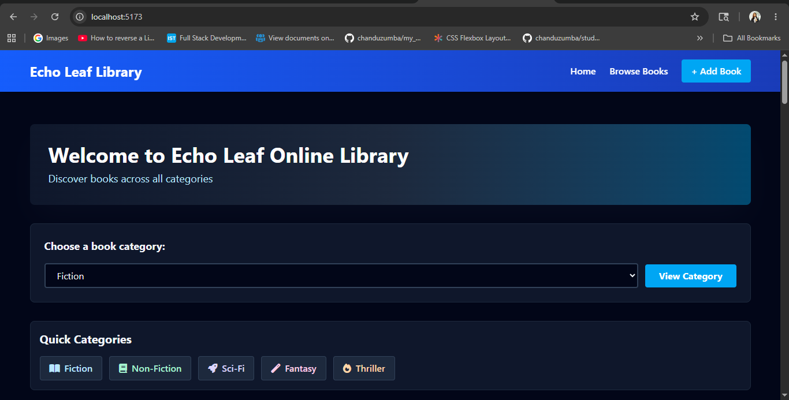
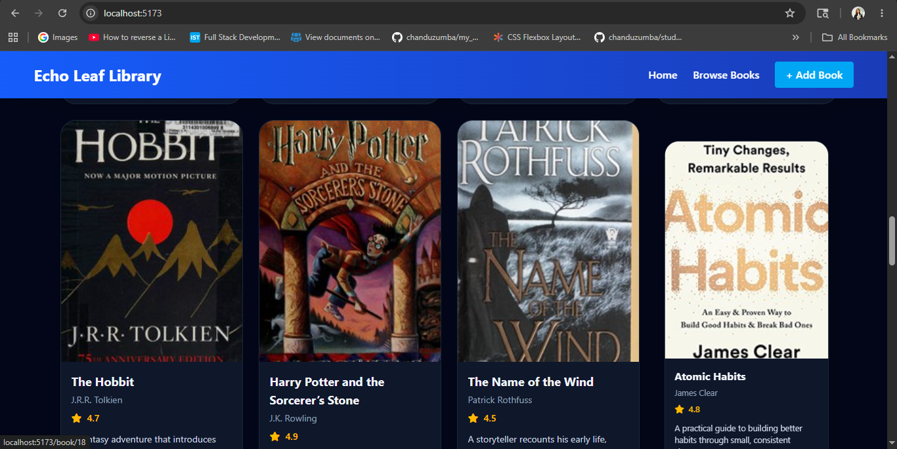

#  Echo Leaf Library

A modern and responsive online library web application built to explore, organize, and discover books with a clean user experience.

---

##  Features

-  Browse books collection
-  Search functionality
-  Popular / Category Based books
-  Add new book
-  Responsive modern UI
-  Fast and lightweight
-  Mobile-friendly design

---

## Tech Stack

- HTML5
- CSS3
- JavaScript
- React.js
- Redux Toolkit
- Tailwind CSS

---

##  Project Structure

```bash
echo-leaf-library/
│
├── src/
│   ├── components/
├──     ├── AddBook.jsx
├──     ├── Book.jsx
├──     ├── BookList.jsx
├──     ├── Header.jsx
├──     ├── PageNotFound.jsx
│   ├── pages/
├──     ├── BookDetails.jsx
├──     ├── BrowseBooks.jsx
├──     ├── Home.jsx
├── ├── store/
├──     ├── slices/
├──         ├── bookSlice.js
├──     ├── index.js
├── ├── utils/
├──     ├── books.js
├── ├── constants/
├──     ├── categories.js
│   ├── App.jsx
│   └── index.jsx
│
├── package.json
├── index.html
└── README.md
```

## Preview




## Installation & Setup

Clone the repository:

```bash
git clone https://github.com/chanduzumba/echo-leaf-library.git
```

Navigate to the project folder:

```bash
cd echo-leaf-library
```

Install dependencies:

```bash
npm install
```

Start the development server:

```bash
npm run dev
```

The app will run on:

```bash
http://localhost:5173
```

## Learning Outcomes

Through this project, I practiced:

- React component structure
- State management using Hooks
- Event handling
- Conditional rendering
- Responsive UI development
- Redux Store Management
- Routing for SPA using React Router DOM


## Author

Chandrika Prakash

- GitHub: https://github.com/chanduzumba
- LinkedIn: https://www.linkedin.com/in/chandrika-prakash-06723a266/
- Check it out live on : https://echo-leaf-library.vercel.app/

